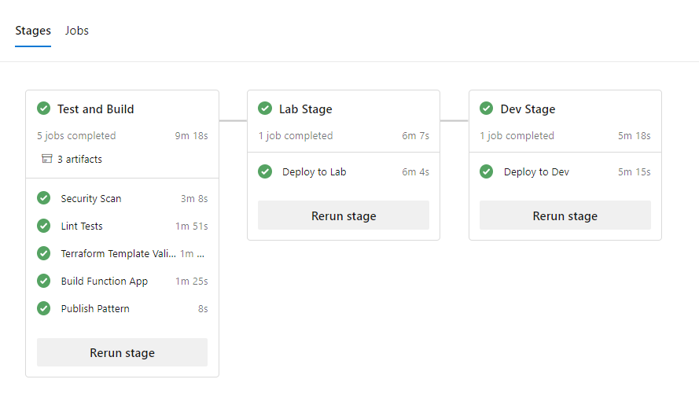
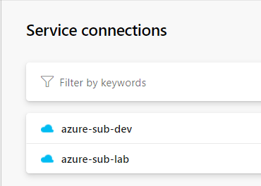
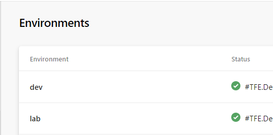
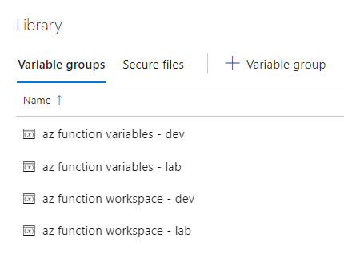
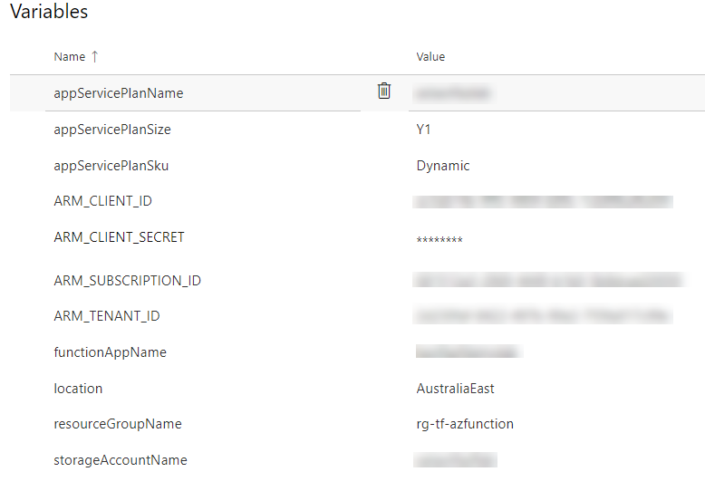
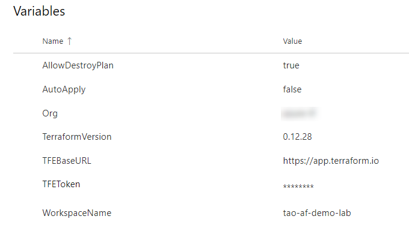

# Sample Azure Pipeline

## Introduction

This folder contains a contains a sample CI/CD pipeline that deploys a compiled C# Azure Function app.

It demonstrates how to integrate Terraform Enterprise or Terraform Cloud with a CI/CD pipeline. Comparing to the native integration capability between Terraform Enterprise (or Terraform Cloud) and Git Repo, having a CI/CD pipeline provides the following code advantages:

1. Removed the TFE workspace and Git repo integration, the code stored in your Git repo can be deployed to multiple environments (multiple TFE workspaces).

2. Code tests and security scan using CI/CD

3. Orchestrate the Terraform workspace configuration as part of the pipeline. i.e. To minimize security risks, removing sensitive variables (i.e. secrets) from Terraform Workspace after deployment.

4. Extend beyond Infrastructure as Code (IaaC), providing end-to-end deployments of everything your cloud application is made up. As demonstrated in this example, in addition to the Terraform templates, the application (Azure Function app) is also built and deployed via the same CI/CD pipeline.

The Pipeline contains the following stages:

* **Test and Build**

  * **Security Scan**
    * Anti Malware scan using Microsoft Security Code Analysis Extension
    * Credential scan using Microsoft Security Code Analysis Extension
  * **Lint Tests**
    * Linter code scan using GitHub Super Linter
  * **Terraform Template Validation (Via Terraform Enterprise)**
    * Install tfe PowerShell Module
    * Create TFE workspace (if not exists)
    * Add variables to TFE workspace
    * Create new TFE configuration version
    * Upload code to TFE workspace
    * Create TFE Queue Plan (Plan aborted after plan)
    * Delete Secrets from TFE
  * **Build Function App**
    * Use NuGet 4.4.0
    * NuGet restore
    * dotnet restore
    * Build solution
    * Test Assemblies
    * Publish symbols path
    * Publish Artifacts for Function App
  * **Publish Pattern**
    * publish Terraform Artifacts
* **Deploy to Lab**
  * Install tfe PowerShell Module
  * Create TFE workspace (if not exists)
  * Add variables to TFE workspace
  * Create new TFE configuration version
  * Upload code to TFE workspace
  * Create TFE Queue Plan (Plan aborted after plan)
  * Delete Secrets from TFE
* **Deploy to Dev**
  * Install tfe PowerShell Module
  * Create TFE workspace (if not exists)
  * Add variables to TFE workspace
  * Create new TFE configuration version
  * Upload code to TFE workspace
  * Create TFE Queue Plan (Plan aborted after plan)
  * Delete Secrets from TFE

## Pre-requisites

To use this sample pipeline, the following components need to be created in your Azure DevOps project.

### Service Connections

* azure-sub-dev
* azure-sub-lab

### Environments

* dev
* lab

### Variable Groups

#### az function variables -a (lab|dev)

This variable group contains the variables need to be created in TFE workspace in order to deploy the pattern.

* appServicePlanName
* appServicePlanSize
* appServicePlanSku
* ARM_CLIENT_ID
* ARM_CLIENT_SECRET
* ARM_SUBSCRIPTION_ID
* ARM_TENANT_ID
* functionAppName
* location
* resourceGroupName
* storageAccountName

#### az function workspace - (lab|dev)

This variable group contains the configuration for the TFE workspace.

* AllowDestroyPlan
* AutoApply
* Org
* TerraformVersion
* TFEBaseURL
* TFEToken
* WorkspaceName

### Extensions

This pipeline uses the [Microsoft Security Code Analysis Extension](https://secdevtools.azurewebsites.net/) for security related code scan.
